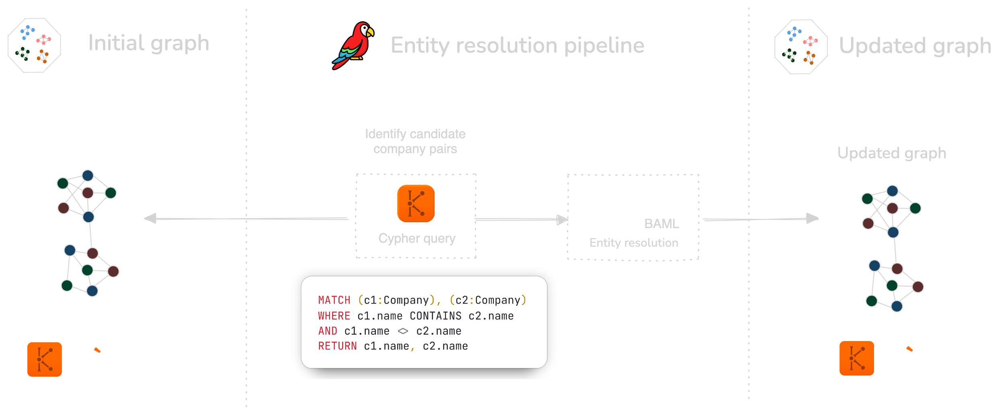
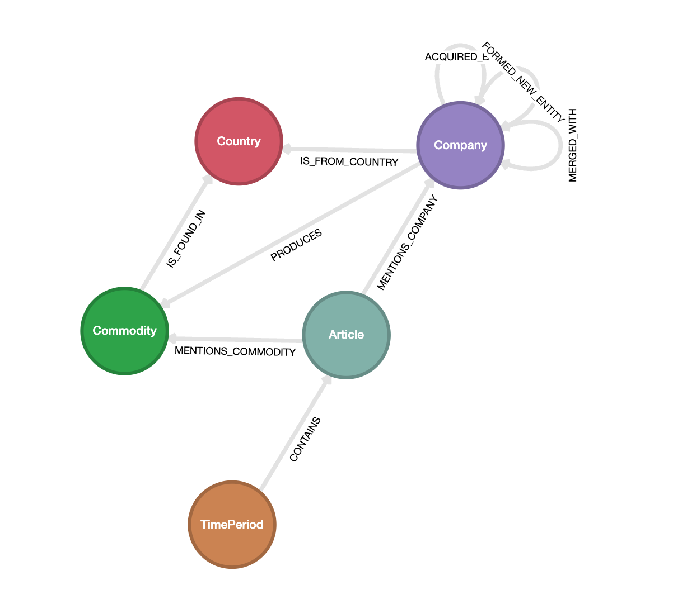
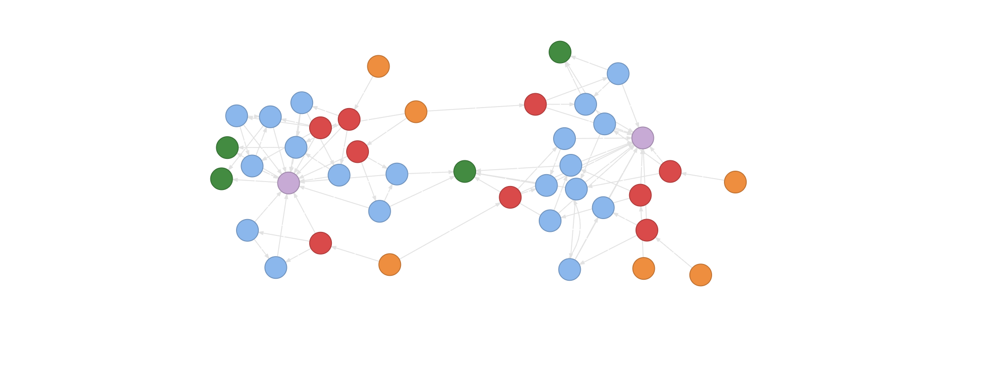

# Getting started with BAML for graphs

This repo contains code for the [Getting started with BAML for graphs](https://lu.ma/lvzwsan1) workshop,
hosted by GraphGeeks.

We'll use [BAML](https://github.com/boundaryML/baml), a domain-specific language to get structured
outputs from LLMs, to extract nodes and relationships from the unstructured data via LLMs. And we'll
also use [Kuzu](https://github.com/kuzudb/kuzu), an embedded graph database, to store and query the
knowledge graph in Cypher.

See [here](https://github.com/graphgeeks-lab/baml-for-graph-101/blob/main/GraphGeeks_Kuzu_BAML_Workshop.pdf)
for the slides we'll use in the workshop. The rest of the good stuff is in the code!

## Problem statement

Imagine you are a developer at a financial asset company, tasked with tracking the merger and
acquisition (M&A) activity of companies in the mining industry. You have access to a news API
feed that updates daily with articles about the various mergers and acquisitions occurring in the
mining industry.

Due to the nature of the problem, you're inherently interested in the *relationships* between companies
and their associated entities in the data. However, the raw data is not in a structured format, so
you will need to use LLMs to help extract, transform and organize the data into a knowledge graph.
The knowledge graph must contain nodes and edges that connect companies, commodities, countries, and
the time periods in which the M&A events occur, so that you can power downstream applications like a
signal alert bot or a question-answering system (based on Graph RAG).

## Methodology

Because the raw data (described below) is not in a structured format, we first need to create a
knowledge graph that captures the relationships between the entities described in the articles.

The steps are as follows:

1. Sketch a schema for the knowledge graph.
2. BAML pipeline 1: Extract structured data from the raw articles.
    - Function 1: Classify a news article as either a merger, acquisition, or neither.
    - Function 2: Extract the information from articles that are about mergers into `data/mergers.json`.
    - Function 3: Extract the information from articles that are about acquisitions into `data/acquisitions.json`.
    - Function 4: Extract the commodities that are produced by the companies & countries mentioned in the articles.
3. Create knowledge graph: Insert the extracted data into a Kuzu database.
4. BAML pipeline 2: Fix company name extraction quality issues (entity resolution).
    - Function 5: Identify whether a company is the same as another company, based on neighbourhood information from the graph.
5. Query the knowledge graph using Cypher!

### BAML pipeline 1
The first BAML pipeline is shown in the following diagram.


This produces two subgraphs, one for mergers and one for acquisitions, which are connected to each
other because they may share the same companies, commodities, countries, etc.

### BAML pipeline 2

Once the initial BAML pipeline is complete, we may have some quality issues with the extracted
entities, particularly with company names. For example, `Newcrest Mining` can also be present as
`Newcrest Mining Limited` in some articles, resulting in duplicate company names.
To address this, we can use a secondary BAML pipeline after identifying the duplicate company names
where one company name is a substring of another.



The final graph is updated where each company entity we detected as a duplicate elsewhere in the graph
has a `alias` property that contains all the aliases for the company. We can also store the aliases
as relationships between the company nodes, so that we can query them later.

> [!NOTE]
> Each BAML function is orchestrated via Python logic. More sophisticated error
> handling and fallbacks ("agentic workflows") can be implemented as necessary by using your framework
> of choice on top of BAML -- however, for a lot of cases like this, simple Python code is all you need.

## Data

The dataset consists of publicly available news articles about M&A activity in the mining industry, from
popular websites like [mining.com](https://www.mining.com/), [australianmining.com](https://www.australianmining.com.au/) and [northernminer.com](https://www.northernminer.com/). The data is semi-structured and in JSON format,
with metadata about each article, as well as the article's content.

See the file [`data/articles.json`](data/articles.json) for the input data used for this project.

## Graph Schema

The graph schema being modelled is shown in the following diagram:



## Setup

### Python environment
It's recommended to [install uv](https://docs.astral.sh/uv/getting-started/installation/) to manage the dependencies.

```bash
uv sync
```
Alternatively, you can install the dependencies manually via pip.

```bash
pip install -r requirements.txt
```

### BAML client

The BAML client code is auto-generated by the source files in `baml_src/`. Once you clone this repo
and activate the Python virtual environment, generate the client code by running the following command:

```bash
source .venv/bin/activate
baml-cli generate
```

There will be a new directory `baml_client/` created in the root of the repo, containing the generated
Python code for the BAML client.

### Kuzu

Kuzu is an embedded (in-process) graph database, so there is no setup required! It's already included
as a dependency in the `pyproject.toml` file, installed via `uv sync`.

## Run the workflow

To run the code, the default (recommended) way is to use the `uv run` command. Alternatively,
you can run the code by replacing `uv run` with `python` in the commands below.

### Step 1: Extract structured data from the raw articles

The BAML extraction pipeline is in `00_extractor.py`. See the `baml_src/` directory for the
BAML prompts used in each stage.

```bash
uv run 00_extractor.py
```

### Step 2: Create graph schema

The graph schema is defined in `01_create_schema.py`. This initializes a new, empty Kuzu database
into which we will load the data extracted in the previous step.

```bash
uv run 01_create_schema.py
```

### Step 3: Create merger subgraph

The graph is created in stages, starting with the `merger` subgraph.

```bash
uv run 02_create_merger_subgraph.py
```

### Step 4: Create acquisition subgraph

The next step is to create the `acquisition` subgraph.

```bash
uv run 03_create_acquisition_subgraph.py
```



The unstructured data is now transformed and stored as a knowledge graph in Kuzu!

### Step 5: Resolve entity duplicates

The next step is to resolve entity duplicates. This will run a secondary BAML pipeline to identify
duplicate company names and update the graph with the correct aliases.

```bash
uv run 04_entity_resolve.py
```

The aliases are stored both as properties on the company nodes, and as relationships between the
company nodes, so that multiple modes of querying them are possible.

### Step 6: Query the graph

That's it! We now have a knowledge graph stored in Kuzu that we can use to answer queries
such as the following:

```cypher
// Which companies produce gold and where are they located?
MATCH (c:Company)-[:PRODUCES]->(ct:Commodity {name: "Gold"})
OPTIONAL MATCH (c)-[:IS_FROM_COUNTRY]->(country:Country)
RETURN c.name AS company,
       COALESCE(country.name, "Unknown") AS country_name,
       ct.name AS commodity
ORDER BY country_name, company DESC;
```

```
┌─────────────────────────┬──────────────┬───────────┐
│ company                 │ country_name │ commodity │
│ STRING                  │ STRING       │ STRING    │
├─────────────────────────┼──────────────┼───────────┤
│ Ramelius Resources      │ Australia    │ Gold      │
│ Northern Star Resources │ Australia    │ Gold      │
│ Newcrest Mining         │ Australia    │ Gold      │
│ De Grey Mining          │ Australia    │ Gold      │
│ Pretium Resources       │ Canada       │ Gold      │
│ Equinox Gold            │ Canada       │ Gold      │
│ Calibre Mining          │ Canada       │ Gold      │
│ Spartan Resources       │ Unknown      │ Gold      │
│ Newmont                 │ Unknown      │ Gold      │
│ Newcrest Mining Limited │ Unknown      │ Gold      │
└─────────────────────────┴──────────────┴───────────┘
```

Graphs are incredibly powerful to query deeply connected data, especially for recursive joins and
path-finding queries. Below is an example that shows how to find all the paths between two companies,
regardless of the types of relationships.

```cypher
MATCH (c1:Company)-[r*1..5]-(c2:Company)
WHERE c1.name = "Ramelius Resources"
AND c2.name = "Newcrest Mining"
RETURN *;
```

This recursive join in Cypher shows that there are numerous paths between two companies (without
specifying the direction of the relationships), and that the paths pass through countries, commodities
and other companies. These sorts of queries are _much_ harder to do in SQL, because you have to
explicitly enumerate all the possible joins and their associated tables.

There are many more queries that can be run on the graph, either written by hand or by LLMs, and we'll
explore them in more detail in the workshop. See you there!