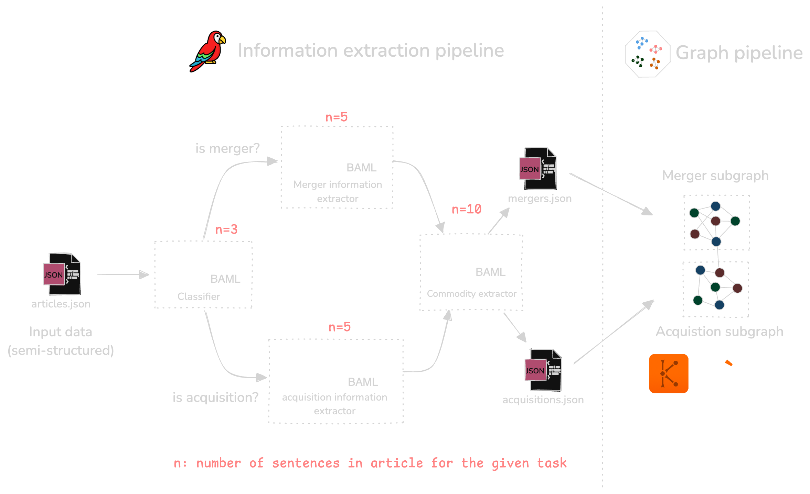
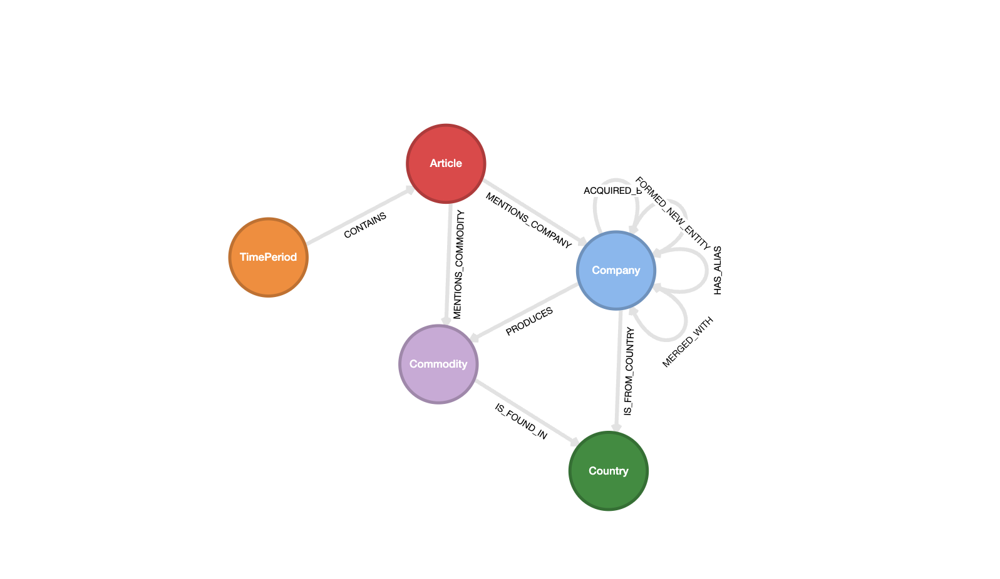

# Getting started with BAML for graphs

This repo contains code for the [Getting started with BAML for graphs](https://lu.ma/lvzwsan1) workshop,
hosted by GraphGeeks.

We'll use [BAML](https://github.com/boundaryML/baml), a domain-specific language to get structured
outputs from LLMs, to extract nodes and relationships from the unstructured data via LLMs. And we'll
also use [Kuzu](https://github.com/kuzudb/kuzu), an embedded graph database, to store and query the
knowledge graph in Cypher.

## Problem statement

Imagine you are a developer at a financial asset company, tasked with tracking the merger and
acquisition (M&A) activity of companies in the mining industry. You have access to a news API
feed that updates daily with articles about the various mergers and acquisitions occurring in the
mining industry.

Due to the nature of the problem, you're inherently interested in the *relationships* between companies
and their associated entities in the data. However, the raw data is not in a structured format, so
you will need to use LLMs to help extract, transform and organize the data into a knowledge graph.
The knowledge graph must contain nodes and edges that connect companies, commodities, countries, and
the time periods in which the M&A events occur, so that you can power downstream applications like a
signal alert bot or a question-answering system (based on Graph RAG).

## Methodology

Because the raw data (described below) is not in a structured format, we first need to create a
knowledge graph that captures the relationships between the entities described in the articles.

The steps are as follows:

1. Sketch a schema for the knowledge graph.
2. Use a series of BAML functions to prompt an LLM to extract structured data from the raw articles.
  - Function 1: Classify a news article as either a merger, acquisition, or neither.
  - Function 2: Extract the information from articles that are about mergers into `data/mergers.json`.
  - Function 3: Extract the information from articles that are about acquisitions into `data/acquisitions.json`.
  - Function 4: Extract the commodities that are produced by the companies & countries mentioned in the articles.
3. Create a knowledge graph in Kuzu using the data extracted by the LLMs.
4. Fix company name extraction quality issues (entity resolution) via a secondary BAML pipeline.
5. Query the knowledge graph using Cypher.

### BAML pipeline 1
The first BAML pipeline is shown in the following diagram.



This produces two subgraphs, one for mergers and one for acquisitions, which are connected to each
other because they may share the same companies, commodities, countries, etc.

### BAML pipeline 2

Once the initial BAML pipeline is complete, we may have some quality issues with the extracted
entities, particularly with company names. For example, `NewCrest Mining` can also be present as
`NewCrest Mining Limited` in some articles, resulting in duplicate company names.
To address this, we can use a secondary BAML pipeline after identifying the duplicate company names
where one company name is a substring of another.


The final graph is updated where each company entity where we detected a duplicate entity elsewhere
in the graph has a `alias` property that contains all the aliases for the company.

> [!NOTE]
> Each BAML function is orchestrated via Python logic. More sophisticated error
> handling and fallbacks ("agentic workflows") can be implemented as necessary by using your framework
> of choice on top of BAML -- however, for a lot of cases like this, simple Python code is all you need.

## Data

The data consists of publicly available news articles about M&A activity in the mining industry, from
popular websites like [mining.com](https://www.mining.com/), [australianmining.com](https://www.australianmining.com.au/) and [northernminer.com](https://www.northernminer.com/). The data is semi-structured and in JSON format,
with metadata about each article, as well as the article's content.

See the file [`data/articles.json`](data/articles.json) for the input data used for this project.

## Graph Schema

The graph schema being modelled is shown in the following diagram:



## Setup

It's recommended to [install uv](https://docs.astral.sh/uv/getting-started/installation/) to manage the dependencies.

```bash
uv sync
```
Alternatively, you can install the dependencies manually via pip.

```bash
pip install -r requirements.txt
```

## Usage

To run the code, the default (recommended) way is to use the `uv run` command. Alternatively,
you can run the code by replacing `uv run` with `python` in the commands below.

### Step 1: Extract structured data from the raw articles

The BAML extraction pipeline is in `00_extractor.py`. See the `baml_src/` directory for the
BAML prompts used in each stage.

```bash
uv run 00_extractor.py
```

### Step 2: Create graph schema

The graph schema is defined in `01_create_schema.py`. This initializes a new, empty Kuzu database
into which we will load the data extracted in the previous step.

```bash
uv run 01_create_schema.py
```

### Step 3: Create merger subgraph

The graph is created in stages, starting with the `merger` subgraph.

```bash
uv run 02_create_merger_subgraph.py
```

### Step 4: Create acquisition subgraph

The next step is to create the `acquisition` subgraph.

```bash
uv run 03_create_acquisition_subgraph.py
```


The unstructured data is now transformed and stored as a knowledge graph in Kuzu!

### Step 5: Query the graph

That's it! We now have a knowledge graph stored in Kuzu that we can use to answer queries
such as the following:

```cypher
// Which companies produce gold and where are they located?
MATCH (c:Company)-[:PRODUCES]->(ct:Commodity {name: "Gold"}),
      (c)-[:IS_FROM_COUNTRY]->(country:Country)
RETURN c.name, country.name
```

```
┌─────────────────────────┬──────────────┐
│ c.name                  ┆ country.name │
│ ---                     ┆ ---          │
│ str                     ┆ str          │
╞═════════════════════════╪══════════════╡
│ Northern Star Resources ┆ Australia    │
│ De Grey Mining          ┆ Australia    │
│ Ramelius Resources      ┆ Australia    │
│ Newcrest Mining         ┆ Australia    │
│ Westgold                ┆ Australia    │
│ Calibre Mining          ┆ Canada       │
│ Pretium Resources       ┆ Canada       │
│ Equinox Gold            ┆ Canada       │
│ Newmont                 ┆ USA          │
└─────────────────────────┴──────────────┘
```

There are many more queries that can be run on the graph, and we will explore them, as well as the
methodology in much more detail in the workshop. See you there!